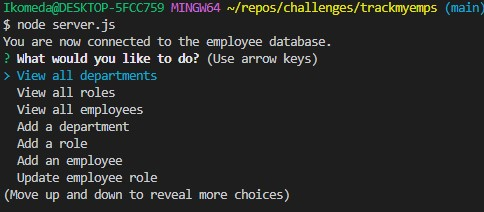
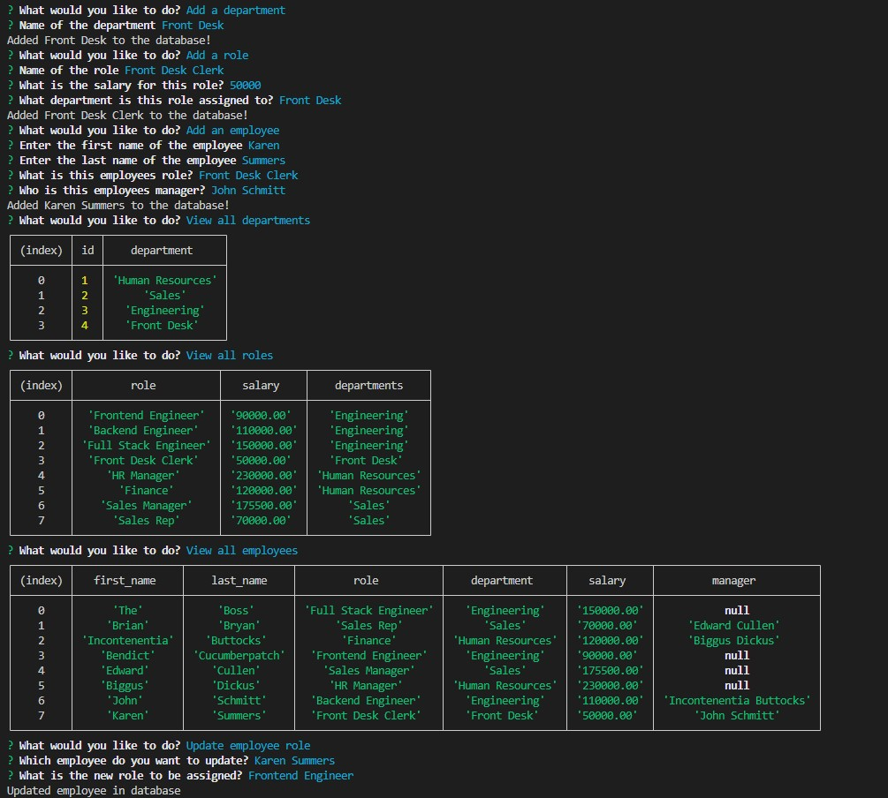

# trackmyemps

### Screenshots

  
  ## License
  
  ## Description
  Backend program for updated an employee database allowing you to modify departments, roles, and employee managers as well as salaries. An easy way to keep track of employees!
  ## Table of Contents
- [trackmyemps](#trackmyemps)
    - [Screenshots](#screenshots)
  - [License](#license)
  - [Description](#description)
  - [Table of Contents](#table-of-contents)
  - [Installation](#installation)
  - [Usage](#usage)
  - [Contributions](#contributions)
  - [Test Instructions](#test-instructions)
  - [Contact](#contact)
  ## Installation
  Clone the repository on your device and incorporate this into your employee database.
  ## Usage
  Enter the terminal and access mysql then SOURCE the ./db/schema.sql and ./db/seeds.sql files. From there quit mysql and then enter node server.js and you'll be able to begin modifying, adding, and updating employees!
  ## Contributions
  n/a
  ## Test Instructions
  n/a
  ## Contact
  * GitHub: https://github.com/Ikomeda/
  * Email: n/a